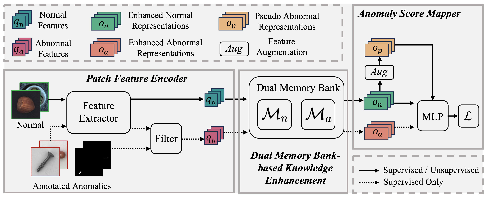

# DMAD

## Intro
This is the source code of DMAD. DMAD employs a dual memory bank ($\textit{i.e.}$ normal memory bank and seen anomaly memory bank) to construct a reinforced feature-residual representations and uses a mlp to distinguish these representations. The framework of DMAD is blow.

The main part of the code:
- `config.py` is a global setting.
- `run.py` is the start procedure.
- `model.py` contains code of model architecture and training / evaluating.
- `datasets/base.py` dataset class for normal and seen anomaly.

## Environment 

**Python3**, **PyTorch**

**Packages**:
- torch==1.12.1
- torchvision==0.13.1
- numpy==1.22.4
- opencv-python==4.5.1
- faiss-gpu

## How to use it
- Step1. Prepare your datasets.
- Step2. Edit the `config.py`, set the dataset name, dataset path, number of anomalies etc.
- Step3. Training. `python3 run.py`.
- Step4. Evaluating. Remember to edit the `config.py` before your evaluation, set the mode to test, then run `python3 run.py`.
